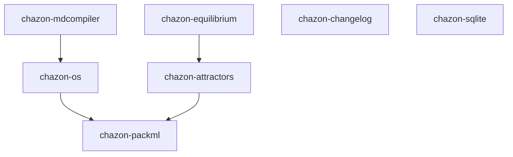
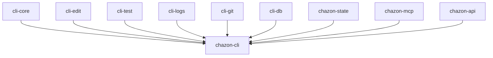
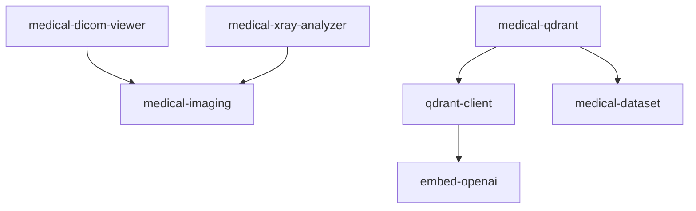
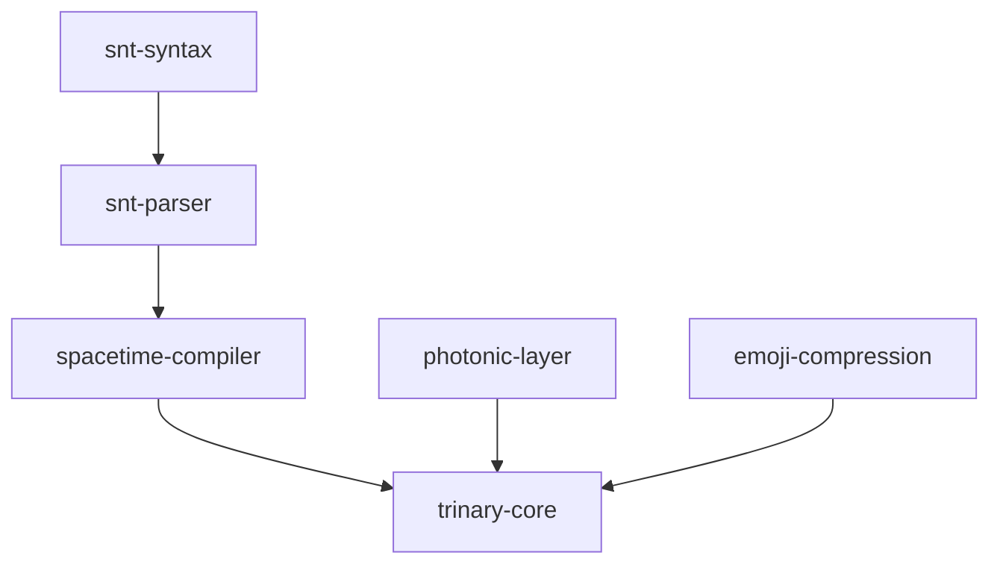
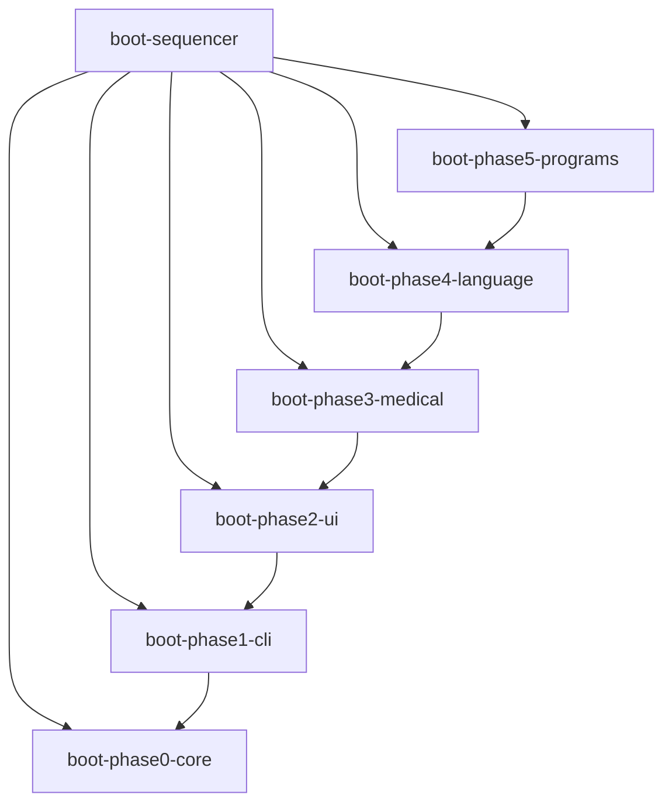
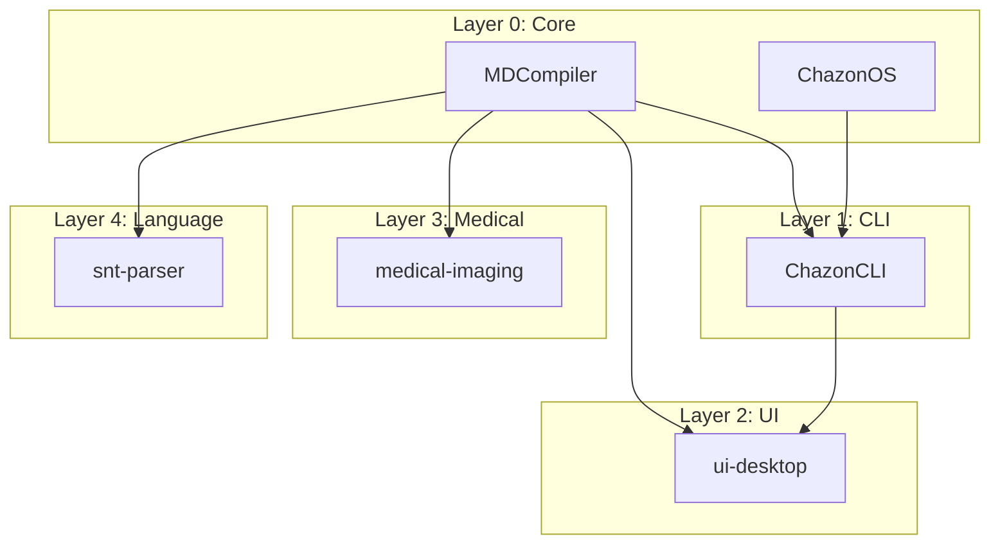
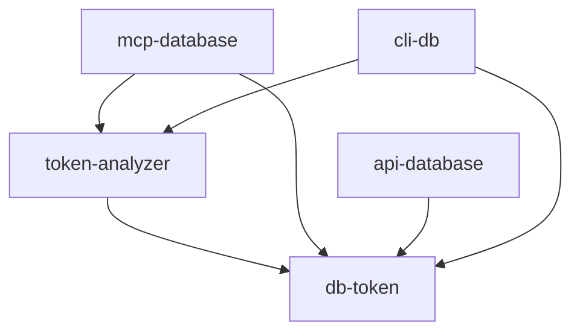

# Dependency Graph
**Module Dependencies** | Complete Dependency Tree

Complete dependency graph for all Chazon modules.

## Core Dependencies


## CLI Dependencies


## Medical Dependencies


## Language Dependencies


## Boot Dependencies


## Cross-Layer Dependencies


## Token Database Dependencies


## Execution Flow
```
1. Boot Sequencer Loads
   ├── Phase 0: Core (MDCompiler, OS)
   ├── Phase 1: CLI (ChazonCLI + command modules)
   ├── Phase 2: UI (Desktop, Agents)
   ├── Phase 3: Medical (DICOM, Qdrant)
   ├── Phase 4: Language (SNT, Trinary)
   └── Phase 5: Programs (User programs)

2. User Interaction
   ├── Terminal Input
   ├── ChazonCLI.exec()
   ├── Command Router
   └── Module Execution

3. Data Flow
   ├── Input → Parser → Processor → Output
   └── Database ← API/MCP → Frontend
```

## Critical Paths

### Boot Critical Path
```
MDCompiler → ChazonOS → ChazonCLI → Terminal → Ready
```

### Medical Imaging Path
```
Upload → DICOM Parser → Window/Level → AI Analysis → Qdrant Search → Results
```

### Language Execution Path
```
SNT Code → Parser → SpaceTime Compiler → Trinary Core → Execution
```

### Database Query Path
```
CLI/API → TokenDB → SQL Query → Results → Display
```
